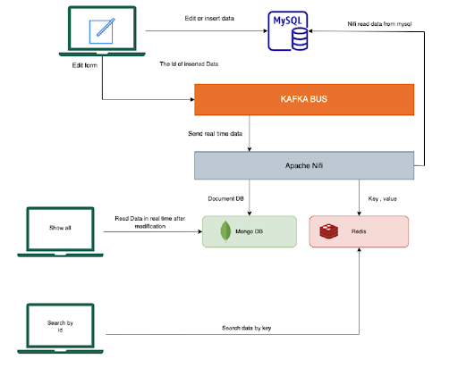

# CacheSystem

---

# Introduction

### **In this project, We will set up a cache system.**

The architecture’s design is the following :

In order to accomplish this architecture it is obvious that a robust cluster is needed. 

I will use **docker** to maintain this structure. So it will come fist amongst the series of required installations.

# 👷🏻‍♂️ TIME TO **BUILD** 👷🏻‍♂️
